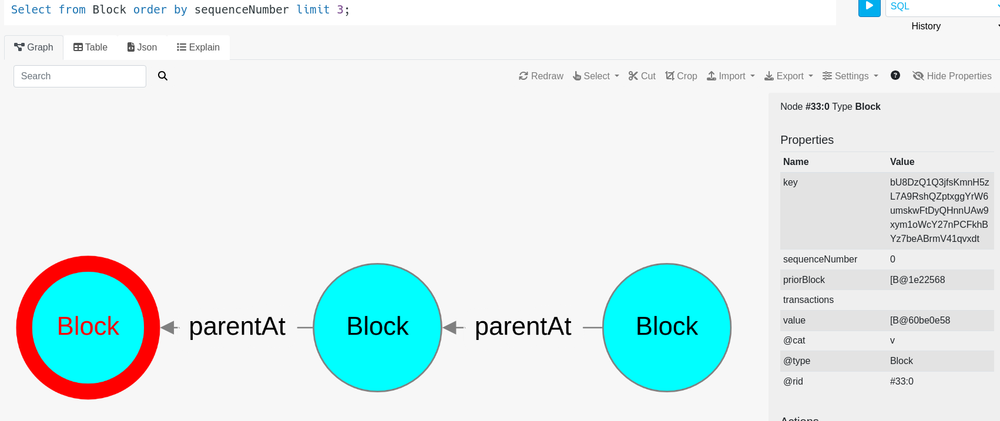
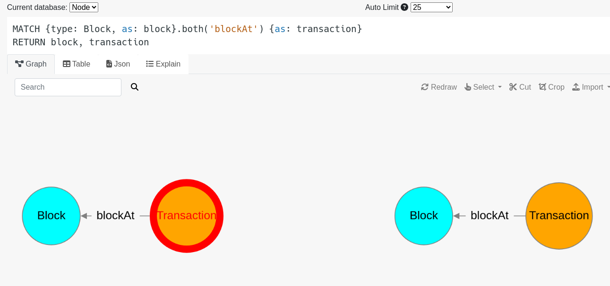

# thaConstellation
Take Home Assessment: Constellation


####  A user want to start to operate in the bank

- User generates a key pair (generate  command)
- User register the account in the node (register command)
- The bank validate that the account does not exist previously and trigger some process to validate that the user is associated with some account in the bank,
  then the node create a transaction from the server account with such amount. This feature is not implemented, to simplify things your will receive a $100 gift.

### Cryptography
The cryptography used in to sign and validate message was.

```
Provider          = "BC"
ProviderAlgorithm = "ECDSA"
SignatureAlgorithm = "SHA256withPLAIN-ECDSA"
ECNamedCurveTable = ("B-571")
```

### Apis

Apis are accessible via REST API, if you use a tool like curl, to create http-bodies for request is not strait forward, I you prefer avoid this steps use the **CLI**

if you need a body to get a balance of an account

> - POST /account/balance 
> - body = (AddressId -> binary -> hash -> sign -> AddressIdSigned -> binary)  
> - header: application/octet-stream


if you want to register an account

> - POST /account/register 
> - body (Account -> binary -> hash -> sign -> AccountSigned -> binary) 
> - header: application/octet-stream

if you try to get Block information, here is not neccesary to sign the body, the information is public

> - POST /block
> - body (BlockId -> binary)
> - header: application/octet-stream

... more examples


A `swagger.yml` is attached in the root repository which describe the Api operations. [swagger](https://editor.swagger.io/)


- POST /account/balance
  - body : Binary encoded model of class: [AddressIdSigned](./common/src/main/scala/io/github/nandotorterolo/models/AddressIdSigned.scala)
 
- POST /account/register
  - body : Binary encoded model of class: [AccountSigned](./common/src/main/scala/io/github/nandotorterolo/models/AccountSigned.scala)

- POST /transaction/broadcast
  - body : Binary encoded model of class: [TransactionSigned](./common/src/main/scala/io/github/nandotorterolo/models/TransactionSigned.scala)
- 
- POST /transaction/inspect
  - body : Binary encoded model of class: [TransactionIdAddressIdSigned](./common/src/main/scala/io/github/nandotorterolo/models/TransactionIdAddressIdSigned.scala)

- POST / block
  - body : Binary encoded model of class: [BlockId](./common/src/main/scala/io/github/nandotorterolo/models/BlockId.scala)

### CLI

#### Generate Private/Public keys
Generate a private/public key key pair

The cli will create a couple of files under a folder defined by config.

```
CLI:
Enter option. [inspect | gen | tx | reg | bal | block | help | quit]
> gen
Lets generate a private-public key pair.
Enter Key name parameter. (Ex: )
> user_a
Writing to keys/user_a
A private file was saved on ./keys/user_a
Writing to keys/user_a.pub
A public file was saved on ./keys/user_a.pub
Your base58 AddressId: 3FTBbJzQptLTbNVZyCvNQeScRcSQ
You could continue with registration step
```

#### Register an Account
Register and account on the Bank. You will receive a gift of 100.

```
Enter option. [inspect | gen | tx | reg | bal | block | help | quit]
> reg
Lets register an Address
Enter Private Key name parameter. (Ex: )
> user_a
send registration? [ y | n ]
> y
OK: "Account Registered"
```

#### Get Balance
Given an address and a private key, obtain details of an account

You will be rejected if the provided Private key matches the address/account

```
Enter option. [inspect | gen | tx | reg | bal | block | help | quit]
> bal
Get balance from an Address
Enter <SOURCE> Address parameter. (Ex: JpE3CyJtqsJ35cE6U1uq7RKXLAg)
> 3FTBbJzQptLTbNVZyCvNQeScRcSQ
Enter Private Key: parameter. (Ex: id)
> user_a
{"address":"3FTBbJzQptLTbNVZyCvNQeScRcSQ","balance":100.0,"latestUsedNonce":0}
```

### Inspect an Account

Sometimes you register an account, for forget your address, this command will show you the address if you provide a public key

```
Enter option. [inspect | gen | tx | reg | bal | block | help | quit]
> inspect
Lets Inspect a PUBLIC key
Enter Public Key name parameter. (Ex: a.pub)
> user_a.pub
Your address: 3FTBbJzQptLTbNVZyCvNQeScRcSQ
```

### Submit a Transaction
- lets submit a transaction from user_a to user_b
- If you don't remember add user_b address you can inspect using user_b public key
- the promt will ask, source, destination address, amount and nonce, finally provide your user_a private key to sign the transaction

```
Enter option. [inspect | gen | tx | reg | bal | block | help | quit]
> inspect
Lets Inspect a PUBLIC key
Enter Public Key name parameter. (Ex: a.pub)
> user_b.pub
Your address: 4B7Y4UF5w2Zu7cMQcgJ1g9iFUa8U

Enter option. [inspect | gen | tx | reg | bal | block | help | quit]
> tx
Lets create a Transaction
Enter <DESTINATION> Address parameter. (Ex: 3FTBbJzQptLTbNVZyCvNQeScRcSQ)
> 4B7Y4UF5w2Zu7cMQcgJ1g9iFUa8U
Enter Amount to transfer parameter. (Ex: 100, 3.4)
> 1
Enter nonce parameter. (Ex: 1, 2, 3, 4)
> 2
Lets sign the Transaction
Enter <SOURCE> Private Key name parameter. (Ex: )
> user_a
send transaction? [ y | n ]
> y
"{\n  \"source\" : \"3FTBbJzQptLTbNVZyCvNQeScRcSQ\",\n  \"destination\" : \"4B7Y4UF5w2Zu7cMQcgJ1g9iFUa8U\",\n  \"amount\" : 1.0,\n  \"nonce\" : 2\n}
```

### Get a Block
Display block information givven the blockId (hash)

```
CLI:
Enter option. [inspect | gen | tx | reg | bal | block | help | quit]
> block
Get block information
Enter Block Id parameter. (Ex: base 58)
> 5YBCf1CzwJocQeYhYVfoeyBwAL3VeW6wpXkQLDbjU5L6NVDxLvcTm6hidtQmCj8XZZam2qRzwX19u9k1rdmAdWpB
OK: "{\n  \"priorBlock\" : \"4sK8d6YWkew8R6SZUoVX9mUY4JyyQScux3Qsqs85u4msMaWuszT9k4Cf6iB69NpLTRyGV2uaQrxUcSgB8pF4d4kc\",\n  \"sequenceNumber\" : 173,\n  \"transactions\" : \"\"\n}"
```

### Get a Transaction

You only can obtain a transaction if your account was the source, or destination

```
CLI:
Enter option. [inspect | gen | tx | reg | bal | block | help | quit]
> inspectTx
Inspect transaction information
Enter Transaction Id parameter. (Ex: 5YBCf1CzwJocQeYhYVfoeyBwAL3VeW6wpXkQLDbjU5L6NVDxLvcTm6hidtQmCj8XZZam2qRzwX19u9k1rdmAdWpB)
> 3b8wL11hCj9Ut2oJtB8QgmRbC8dH35Ubj5J5YXMsStDfVC5CnWrgJjDBHdWHp9AFug5NDSo4ppHpfSZ3abFR3PiT
Enter Private Key name parameter. (Ex: )
> user_a
OK: "Signature Validation error"
Enter option. [inspect | gen | tx | reg | bal | block | help | quit]
> inspectTx
Inspect transaction information
Enter Transaction Id parameter. (Ex: 5YBCf1CzwJocQeYhYVfoeyBwAL3VeW6wpXkQLDbjU5L6NVDxLvcTm6hidtQmCj8XZZam2qRzwX19u9k1rdmAdWpB)
> 3b8wL11hCj9Ut2oJtB8QgmRbC8dH35Ubj5J5YXMsStDfVC5CnWrgJjDBHdWHp9AFug5NDSo4ppHpfSZ3abFR3PiT
Enter Private Key name parameter. (Ex: )
> user_b
OK: "{\"source\":\"3iaXTcsxoQUX9Xgjii3trs2KBvtC\",\"destination\":\"4B7Y4UF5w2Zu7cMQcgJ1g9iFUa8U\",\"amount\":100.0,\"nonce\":1}"
```


### Validations
Package validator include all the validation that are evaluated when a transaction is received, and being in the mempool before a block is packaged

- A transaction amount should be positive, non 0
- A transaction source should be different that a destination
- Nonce validator
- Overdraft Validator
- Signature validarion
- ... [validators](./node/src/main/scala/io/github/nandotorterolo/node/validator)


### How to develop

The project contains 3 sbt modules, called node, cli, common

1. Build the cli
```
➜  thaConstellation git:(dev) ✗ sbt ";project cli; assembly"

[info] Built: /home/fernando/development/thaConstellation/cli/target/scala-2.13/cli.jar    <<<< this path
[info] Jar hash: 2b174d20e6c319d16e729a0913b30ea287c0e4c4
[success] Total time: 14 s, completed Aug 14, 2024, 12:25:53 PM
```
2. run the cli 
> java -jar /home/fernando/development/thaConstellation/cli/target/scala-2.13/cli.jar    <<< should be this path

3. run the node
> sbt ";project node; run"


TODO: dockerization of the service

### storage

[Arcade DB](https://docs.arcadedb.com/) server is running embedded and the Studio tool published on http://localhost:2480

- 3 graph schema were defined, accounts, transaction and block
- transactions are communicated with blocks using bidirectional edge
- blocks are communcated with the parent block using bidirectional edge
- In red you can see the genesis block with height 0






#### Could this project be extended for production readiness.

- There are some unit test but coverage is not enough
- There are not integration test
- The service should be dockerized
- Some questions about registration process


